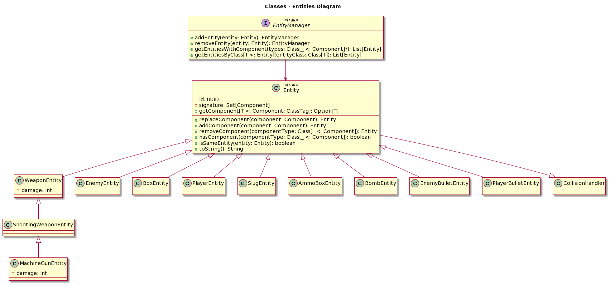

# Design di dettaglio
## Scelte rilevanti
Tipicamente, durante lo sviluppo di applicazioni, si tende a adottare un approccio di design che fa ampio uso dell'ereditarietà. Questa scelta, che implica la creazione di gerarchie semantiche ben definite, solitamente porta a implementazioni più solide e ben strutturate. Tuttavia, quando si tratta di videogiochi, dove è richiesta una grande flessibilità, l'uso di queste gerarchie strutturate può diventare vincolante. Per superare questa problematica nel corso del tempo, si è optato per approcci basati maggiormente sulla composizione. Il pattern architetturale ECS è emerso proprio in linea con questa filosofia di pensiero.

## Pattern di progettazione 
### ECS
Il pattern ECS è costituito da tre parti fondamentali: entità, componenti e sistemi.
* **Entity**: può essere considerata come un contenitore vuoto che aggrega diversi componenti. Un'entità non contiene logica di gioco o dati direttamente; piuttosto, funge da contenitore per i componenti che definiscono il suo comportamento.
* **Component**: è una piccola unità di dati che definisce un aspetto o un comportamento specifico di un'entità. I componenti contengono le informazioni necessarie per descrivere un aspetto specifico dell'entità, e diversi tipi di componenti possono essere combinati per definire il comportamento complessivo dell'entità. E' tramite la loro modularità che è possibile generare comportamenti dinamici nella scena di gioco permettendo di creare diverse meccaniche.
* **System**: Il sistema è responsabile dell'aggiornamento e della gestione dei componenti delle entità. Opera su un insieme di entità che contengono specifici tipi di componenti e applica la logica di gioco attraverso l'elaborazione di questi dati.

### *Applicazione al progetto*:
Si è scelto di applicare il pattern attraverso un approccio di tipo Data-Driven: in questo approccio, le operazioni eseguite su dati sono separate dalla logica di controllo, favorendo una maggiore modularità e flessibilità nel sistema. L’ECS in questo caso sarà caratterizzato da moduli di gestione ai quali saranno delegati il controllo e la connessione di entità e componenti, quest'ultimi prendono il nome di Manager.
All'interno del nostro pattern ECS si è scelto la disposizione di due Manager implementati come **Singleton**:
 1. **Entity Manager**: è responsabile della gestione delle entità nel sistema. Ha la capacità di creare nuove entità, recuperare entità esistenti, e rimuovere entità. Inoltre, tiene traccia di un identificatore univoco per ciascuna entità, garantendo la distinzione tra di esse.
 2. **System Manager**: si occupa della gestione dei sistemi nel sistema ECS. Può aggiungere e rimuovere sistemi, oltre a coordinare l'aggiornamento di tutti i sistemi. In questo contesto, un "sistema" è responsabile dell'elaborazione dei dati delle entità. La funzione update_systems richiama l'aggiornamento di ciascun sistema, consentendo loro di operare sui dati delle entità.

Di seguito viene riportata una rappresentazione tramite diagramma delle classi della nostra implementazione del pattern ECS.

Ciò che si può notare oltre a ciò che è stato precedentemente descritto è la scelta progettuale effettuata per la gestione delle componenti la quale avviene all'interno del trait Entity. Infatti, ogni entità tiene traccia in maniera immutabile di quelle che sono le componenti ad essa associate e quando si va ad aggiornare si sceglie volontariamente di eliminare il tipo precedente per andarlo a sostituire con una nuova componente aggiornata.

Di seguito si riporta una diagramma rappresentativo delle entità coinvolte all'interno dell'applicativo:

Si riporta una breve spiegazione del diagramma:
 - **Weapon Entity**: è una generalizzazione del concetto di arma.
 - **Shooting Weapon Entity**: rappresenta la specializzazione dell'arma nel caso base, l'arma che il giocatore ha di default.
 - **MachineGun Entity**: rappresenta la specializzazione dell'arma nel caso di un powerup.
 - **Enemy Entity**: è il nemico nella scena di gioco.
 - **Box Entity**: è l'ostacolo nella scena di gioco.
 - **Player Entity**: è il giocatore principale nella scena di gioco.
 - **Slug Entity**: è lo slug nella scena di gioco.
 - **Ammo Box Entity**: è la scatola delle munizioni nella scena di gioco.
 - **Bomb Entity**: è la bomba nella scena di gioco.
 - **Enemy Bullet Entity**: è il proiettile nemico nella scena di gioco.
 - **Player Bullet Entity**: è il proiettile del giocatore nella scena di gioco.

La creazione delle entità avviene sia in maniera statica al momento dell'avvio del gioco, sia in maniera dinamica durante l'esecuzione del gioco in base alle azioni svolte dal giocatore, mentre la loro rimozione soltanto in maniera dinamica, così come le componenti associate ad esse.
Un altro aspetto del progetto in cui le entità entrano in gioco è la gestione delle collisioni, infatti, ciascuna di esse ha una sua implementazione personalizzata. Di seguito si riporta il diagramma: 

Ciò che viene rappresentato è un sottoinsieme di interfacce che permettono di personalizzare per ciascuna entità il concetto di collisione all'interno della scena di gioco. Si descrive:
- **Collision Handler**: è l'interfaccia che generalizza il concetto di collisione di una qualsiasi entità.
- **Basic Collision Handler**: è l'interfaccia che specializza la collisione implementandone la logica.
- **Enemy Collision Handler**: è l'interfaccia che specializza le collisioni per i nemici.
- **Player Collision Handler**: è l'interfaccia che specializza le collisioni per il player.
- **Slug Collision Handler**: è l'interfaccia che specializza le collisioni per lo slug.
- **Enemy Bullet Collision Handler**: è l'interfaccia che specializza le collisioni per il proiettile nemico.
- **Player Bullet Collision Handler**: è l'interfaccia che specializza le collisioni per il proiettile del giocatore.
- **Collision Checker**: è interamente dedicato all'implementazione di funzioni di utilità per gestire al meglio le collisioni.

Per quanto riguarda la creazione delle componenti da associare alle entità si fornisce il seguente diagramma delle classi:

Dovendo descrivere brevemente ciascuna di queste:
- **Bullet**: interfaccia che permette di definire diversi tipi di proiettili utilizzati dal Bullet Component
  - **Standard Bullet**: proiettile di default sparato dal player.
  - **Enemy Bullet**: proiettile di default sparato dal nemico.
  - **MachineGun Bullet**: proiettile ottenuto attraverso un powerup.
- **Slug Component**: determina se si sta utilizzando uno slug.
- **Bullet Component**: aggiunge la possibilità di sparare ad una entità.
- **Size Component**: rappresenta la dimensione della finestra di collisione associata ad una entità.
- **Position Component**: indica la posizione all'interno della scena di gioco di una entità.
- **Gravity Component**: applica gli effetti della gravità ad una entità.
- **Jumping Component**: aggiunge la possibilità di saltare ad una entità.
- **Sprite Component**: permette di renderizzare a video tramite uno sprite una entità.
- **Direction Component**: indica la direzione di una entità.
- **AI Component**: se applicata ad una entità questa utilizza un sistema basato sul Prolog per determinarne il suo stato.
- **Player Component**: se applicata ad una entità questa diventa il giocatore principale.
- **Velocity Component**: rappresenta la velocità di una entità nella scena di gioco.
- **Ammo Component**: rappresenta quante munizioni una entità a disposizione da poter sparare.
- **Special Weapon Ammo Component**: determina le munizioni dell'arma ottenuta tramite powerup.
- **Bomb Ammo Component**: determina quante bombe si ha a disposizione.
- **Collision Component**: applica le collisioni ad una entità.
- **Direction**: interfaccia che permette di definire molteplici direzioni utilizzate dal Direction Component.
  - **Right**: direzione destra.
  - **Left**: direzione sinistra.

Il collegamento dinamico di queste componenti permette di attivare la logica dei sistemi che filtrano le entità in base alle componenti di cui dispongono per l'attivazione della loro logica o meno. Successivamente applicano la logica alle entità selezionate risultando nella creazione di nuove meccaniche di gioco per ciascuna di esse.

Di seguito si riporta una visione dei sistemi implementati: 

Di seguito una breve descrizione della logica rappresentata:
- **Systems with Elapsed Time**: interfaccia utilizzata per definire quei sistemi che hanno bisogno di sincronizzarsi con il tempo di gioco.
  - **AI System**: le entità utilizzate da questo system associano in un thread differente da quello principale il comportamento di una macchina a stati finiti sviluppata in Prolog per la scelta randomicizzata di tre azioni: movimento, rimanere fermi, sparare.
  - **Bullet Movement System**: associa alle entità su cui si applica un movimento automatizzato, quindi senza bisogno di un input, nella scena di gioco lungo l'asse X della finestra di gioco.
  - **Gravity System**: associa alle entità la forza di gravità.
  - **Position update System**: associa alle entità su cui si applica un aggiornamento della posizione considerando se è o meno una posizione valida.
- **Systems without Time**: interfaccia utilizzata per definire quei sistemi che astraggono dal tempo di gioco.
  - **Death System**: verifica se effettuare il game over di gioco.
  - **Input System**: applica la logica di input.
  - **Jumping System**: applica una forza di salto.
  - **Sprite System**: effettua l'assegnamento dello sprite corretto all'entità che hanno bisogno di essere renderizzate.

Entrambe le tipologie di sistemi ereditano da una classe system che permette di definire molteplici sistemi. Il system manager è dipendente dall'utilizzo di system, infatti esso tiene traccia di tutti i sistemi aggiunti e ne effettua l'update tramite l'invocazione del metodo "updateAll(...)" che viene invocato dall'Engine.

### Observer Pattern
L'Observer Pattern è un design pattern comportamentale che definisce una dipendenza uno-a-molti tra oggetti in modo che quando un oggetto cambia stato, tutti i suoi dipendenti siano notificati e aggiornati automaticamente. Questo pattern è utile in scenari in cui un oggetto, chiamato "subject" (soggetto), deve notificare altri oggetti, chiamati "observers" (osservatori), di qualsiasi cambiamento senza conoscere a priori chi o cosa siano questi osservatori.
### *Applicazione al progetto*:
#### Engine
All'interno dell'applicazione era necessario implementare una logica di gioco che diferisse dal main thread. Questa viene rappresentata tramite il seguente diagramma:

Questo infatti viene implementato nel seguente modo:
- Viene definita una interfaccia **Game Engine** che generalizza al suo interno un unico metodo *tick(elapsedTime: Long): Unit*.
- Viene creata una interfaccia **Engine** che specializza il metodo *tick(elpasedTime: Long): Unit* di Game Engine andando ad aggiornare al suo interno lo stato dei sistemi tramite l'invocazione di *updateAll(elapsedTime: Long)* . Questa aggiunge al suo interno la logica per gestire un vero e proprio motore di gioco, dunque aggiunge metodi come: start, stop, pause e resume.
- L'interfaccia **Game Loop** estende da **Thread**, è bilateralmente dipendente da Engine che ha il compito di istanziarla tramite lo start e di fermarla tramite lo stop. All'interno del suo metodo predefinito *run()* tramite la dipendenza di cui dispone con Engine, richiama il metodo *tick(elapsedTime: Long): Unit* andando ad aggiornare i frame di gioco in modo tale che i sistemi che ne fanno uso siano sincronizzati. ElapsedTime rappresenta l'intervallo di tempo trascorso tra un tick e quello successivo, questo infatti permette di rendere "fluido" il calcolo di variabili come la velocità o la posizione che altrimenti andrebbero a scatti.
- L'interfaccia **Game Status** rappresenta la lista di stati possibili che l'engine e il game loop possono assumere.
Bisogna notare all'interno del diagramma anche un riferimento all'interfaccia **Observable** questo infatti viene utilizzato tramite una *notifyObservers(Tick(EntityManager.entities))* all'interno del metodo *tick(elapsedTime: Long): Unit* per fare sì che l'ordine di esecuzione del gioco rispecchi il seguente:
1. Caricamento degli input.
2. Aggiornamento dei sistemi e logica di gioco.
3. Notifica alla View di effettuare il rendering sulla base dello stato dei sistemi.

La notifyObservers in questo caso prende come argomento un evento definito attraverso una interfaccia che classifica le diverse azioni da far eseguire alla View. Si vuole mostrare un diagramma che mette in relazione questi concetti:

La figura mette in correlazione le diverse classi esaltando le comunicazioni create. La view dispone di un metodo *update()* che al suo interno può eseguire diversi tipologie di comportamento in base all'evento che gli viene passato.

#### View

In figura viene mostrato un grafico descrivente il modulo relativo alla View:

La *View* è stata realizzata utilizzando **JavaFx**, sfruttando l'interoperabilità di Java con Scala.

- **View** è il trait da cui tutte le viste presenti nel gioco ereditano. Definisce che ogni *View* deve avere un *root* all'interno del quale renderizzare gli elementi e inoltre definisce una *given Conversion[View, Pane]* per convertire una *View* in un *Pane*.
- **MainMenu** è la schermata di partenza che viene renderizzata all'avvio dell'applicazione. 
Il suo layout è definito all'interno di un file *.fxml* in quanto non vi era la necessità di dinamismo all'interno di questa schermata.
La schermata contiene due pulsanti, *Start* e *Exit*, mediante i quali è possibile avviare il gioco o chiudere la finestra.  
- **CreateGameView** è un mix-in associato con *MainMenu* che viene utilizzato per popolare *EntityManager* e *SystemManager* correttamente, prima che venga creata la *GameView*. 
- Premendo il tasto *Start*, il gioco inizia e in **GameView** viene caricata la schermata di gioco, caratterizzata dalle entità di gioco. *GameView* renderizza tutti gli elementi visivi all'interno di una Pane, *root*. 

### Command pattern
Il Command Pattern è un design pattern comportamentale che incapsula una richiesta come un oggetto, consentendo la parametrizzazione di client con code, richieste e operazioni. Questo pattern permette di parametrizzare gli oggetti con diverse richieste, di accodare le richieste e di supportare operazioni annullabili. 

### Applicazione nel progetto:
Si riporta un diagramma delle classi che visualizza l'implementazione del pattern:

I concetti chiave da riassumere guardando il seguente diagramma sono: 
Che i comandi rappresentano un'astrazione di un'operazione e includono tutte le informazioni necessarie la sua esecuzione. Vengono definiti all'interno dell'interfaccia **Command**. In questo caso chi crea il comando è la **Game View** che richiamando **Input Handler** tramite l'unico metodo da esso definito *handleInput(command: Entity => Unit): Unit* li inserisce all'interno di uno stack. Sarà poi compito dell'**input system** prendere il comando sulla cima dello **stack**, associarlo all'entità su cui si decide di applicarne gli effetti ed eseguire il comando.
Il Command Pattern è spesso utilizzato nei sistemi di gioco per gestire le interazioni utente, in questo caso la gestione degli input da tastiera. Nel contesto di un motore di gioco, i comandi possono rappresentare azioni come movimenti, sparare, lanciare bombe, ecc. 
La gestione dei comandi sottoforma di coda ha apportato un vantaggio all'interno del progetto, ovvero questi ora possono essere accodati e successivamente eseguiti in modo sequenziale, fornendo un meccanismo flessibile per gestire le richieste. Arricchendo questo sistema si possono anche sviluppare meccaniche in futuro come l'undo dei comandi.

* [Home](../index.md).
