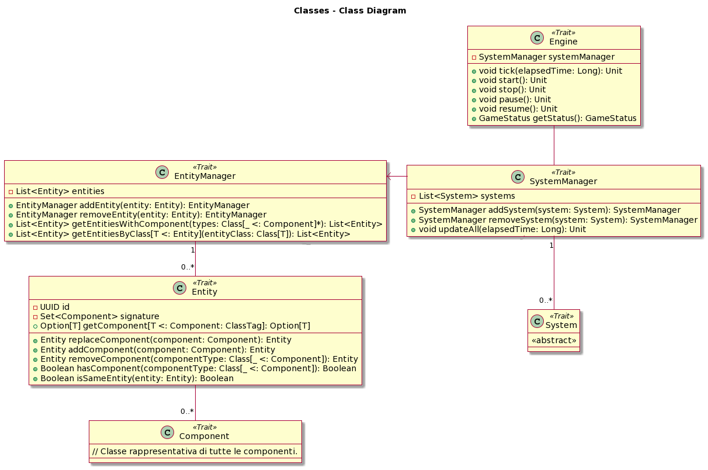

# Design di dettaglio
## Scelte rilevanti
Tipicamente, durante lo sviluppo di applicazioni, si tende a adottare un approccio di design che fa ampio uso dell'ereditarietà. Questa scelta, che implica la creazione di gerarchie semantiche ben definite, solitamente porta a implementazioni più solide e ben strutturate. Tuttavia, quando si tratta di videogiochi, dove è richiesta una grande flessibilità, l'uso di queste gerarchie strutturate può diventare vincolante. Per superare questa problematica nel corso del tempo, si è optato per approcci basati maggiormente sulla composizione. Il pattern architetturale ECS è emerso proprio in linea con questa filosofia di pensiero.

## Pattern di progettazione 
### ECS Pattern
Il modello ECS è costituito da tre parti fondamentali: entità, componenti e sistemi.
* **Entity**: può essere considerata come un contenitore vuoto che aggrega diversi componenti. Un'entità non contiene logica di gioco o dati direttamente; piuttosto, funge da contenitore per i componenti che definiscono il suo comportamento.
* **Component**: è una piccola unità di dati che definisce un aspetto o un comportamento specifico di un'entità. I componenti contengono le informazioni necessarie per descrivere un aspetto specifico dell'entità, e diversi tipi di componenti possono essere combinati per definire il comportamento complessivo dell'entità. E' tramite la loro modularità che è possibile generare comportamenti dinamici nella scena di gioco permettendo di creare diverse meccaniche.
* **System**: Il sistema è responsabile dell'aggiornamento e della gestione dei componenti delle entità. Opera su un insieme di entità che contengono specifici tipi di componenti e applica la logica di gioco attraverso l'elaborazione di questi dati.

### Applicazione al progetto:
Si è scelto di applicare il pattern attraverso un approccio di tipo Data-Driven: in questo approccio, le operazioni eseguite su dati sono separate dalla logica di controllo, favorendo una maggiore modularità e flessibilità nel sistema. L’ECS in questo caso sarà caratterizzato da moduli di gestione ai quali saranno delegati il controllo e la connessione di entità e componenti, quest'ultimi prendono il nome di Manager.
All'interno del nostro pattern ECS si è scelto la disposizione di due Manager:
 1. **Entity Manager**: è responsabile della gestione delle entità nel sistema. Ha la capacità di creare nuove entità, recuperare entità esistenti, e rimuovere entità. Inoltre, tiene traccia di un identificatore univoco per ciascuna entità, garantendo la distinzione tra di esse.
 2. **System Manager**: si occupa della gestione dei sistemi nel sistema ECS. Può aggiungere e rimuovere sistemi, oltre a coordinare l'aggiornamento di tutti i sistemi. In questo contesto, un "sistema" è responsabile dell'elaborazione dei dati delle entità. La funzione update_systems richiama l'aggiornamento di ciascun sistema, consentendo loro di operare sui dati delle entità.

Di seguito viene riportata una rappresentazione tramite diagramma delle classi della nostra implementazione del pattern ECS.

Ciò che si può notare oltre alle entità precedentemente descritte è la scelta progettuale effettuata per la gestione delle componenti la quale avviene all'interno del trait Entity. Questo perché abbiamo scelto di gestire le componenti in maniera immutabile andando a rimpiazzare le componenti ad ogni frame di gioco.

Per quanto riguarda la creazione delle componenti si fornisce il seguente diagramma delle classi: 

### Observable Pattern 
## organizzazione del codice -- corredato da pochi ma efficaci diagrammi)

* [Home](../index.md).
