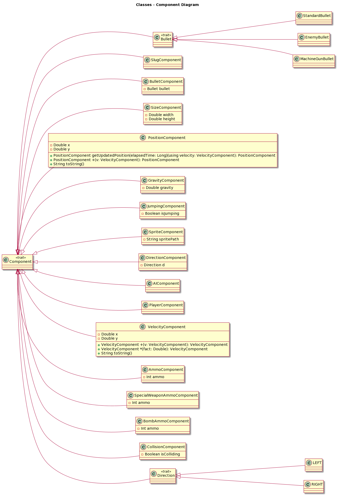

# Design di dettaglio
## Scelte rilevanti
Tipicamente, durante lo sviluppo di applicazioni, si tende a adottare un approccio di design che fa ampio uso dell'ereditarietà. Questa scelta, che implica la creazione di gerarchie semantiche ben definite, solitamente porta a implementazioni più solide e ben strutturate. Tuttavia, quando si tratta di videogiochi, dove è richiesta una grande flessibilità, l'uso di queste gerarchie strutturate può diventare vincolante. Per superare questa problematica nel corso del tempo, si è optato per approcci basati maggiormente sulla composizione. Il pattern architetturale ECS è emerso proprio in linea con questa filosofia di pensiero.

## Pattern di progettazione 
### ECS Pattern
Il modello ECS è costituito da tre parti fondamentali: entità, componenti e sistemi.
* **Entity**: può essere considerata come un contenitore vuoto che aggrega diversi componenti. Un'entità non contiene logica di gioco o dati direttamente; piuttosto, funge da contenitore per i componenti che definiscono il suo comportamento.
* **Component**: è una piccola unità di dati che definisce un aspetto o un comportamento specifico di un'entità. I componenti contengono le informazioni necessarie per descrivere un aspetto specifico dell'entità, e diversi tipi di componenti possono essere combinati per definire il comportamento complessivo dell'entità. E' tramite la loro modularità che è possibile generare comportamenti dinamici nella scena di gioco permettendo di creare diverse meccaniche.
* **System**: Il sistema è responsabile dell'aggiornamento e della gestione dei componenti delle entità. Opera su un insieme di entità che contengono specifici tipi di componenti e applica la logica di gioco attraverso l'elaborazione di questi dati.

### Applicazione al progetto:
Si è scelto di applicare il pattern attraverso un approccio di tipo Data-Driven: in questo approccio, le operazioni eseguite su dati sono separate dalla logica di controllo, favorendo una maggiore modularità e flessibilità nel sistema. L’ECS in questo caso sarà caratterizzato da moduli di gestione ai quali saranno delegati il controllo e la connessione di entità e componenti, quest'ultimi prendono il nome di Manager.
All'interno del nostro pattern ECS si è scelto la disposizione di due Manager:
 1. **Entity Manager**: è responsabile della gestione delle entità nel sistema. Ha la capacità di creare nuove entità, recuperare entità esistenti, e rimuovere entità. Inoltre, tiene traccia di un identificatore univoco per ciascuna entità, garantendo la distinzione tra di esse.
 2. **System Manager**: si occupa della gestione dei sistemi nel sistema ECS. Può aggiungere e rimuovere sistemi, oltre a coordinare l'aggiornamento di tutti i sistemi. In questo contesto, un "sistema" è responsabile dell'elaborazione dei dati delle entità. La funzione update_systems richiama l'aggiornamento di ciascun sistema, consentendo loro di operare sui dati delle entità.

Di seguito viene riportata una rappresentazione tramite diagramma delle classi della nostra implementazione del pattern ECS.

Ciò che si può notare oltre a ciò che è stato precedentemente descritto è la scelta progettuale effettuata per la gestione delle componenti la quale avviene all'interno del trait Entity. Infatti, ogni entità tiene traccia in maniera immutabile di quelle che sono le componenti ad essa associate e quando si va ad aggiornare si sceglie volontariamente di eliminare il tipo precedente per andarlo a sostituire con una nuova componente aggiornata.

Di seguito si riporta una diagramma rappresentativo delle entità coinvolte all'interno dell'applicativo:

???????????????????????????????????????????????????????????????????????????????????????????????????????????????????????!!!!!!!!!?!?!??!?!?!!
//TODO MODIFICARE L'IMMAGINE PER FAR VEDERE CHE é UN MIXIN, WeaponEntity <- Shooting Weapong Entity <- MachineGun entity
//TODO COSA C'ENTRA COLLISION HANDLER IN QUESTA IMMAGINE! AL MASSIMO ACCENNALO NELLA IMG MA POI DEVI PARLARE DELLE COLLISIONI IN UNA SEZIONE A PARTE.
Si riporta una breve spiegazione del diagramma:
 - **Weapon Entity**: è una generalizzazione del concetto di arma.
 - **Shooting Weapon Entity**: rappresenta la specializzazione dell'arma nel caso base, l'arma che il giocatore ha di default.
 - **MachineGun Entity**: rappresenta la specializzazione dell'arma nel caso di un powerup.
 - **Enemy Entity**: è il nemico nella scena di gioco.
 - **Box Entity**: è l'ostacolo nella scena di gioco.
 - **Player Entity**: è il giocatore principale nella scena di gioco.
 - **Slug Entity**: è lo slug nella scena di gioco.
 - **Ammo Box Entity**: è la scatola delle munizioni nella scena di gioco.
 - **Bomb Entity**: è la bomba nella scena di gioco.
 - **Enemy Bullet Entity**: è il proiettile nemico nella scena di gioco.
 - **Player Bullet Entity**: è il proiettile del giocatore nella scena di gioco.

La creazione delle entità avviene sia in maniera statica al momento dell'avvio del gioco, sia in maniera dinamica durante l'esecuzione del gioco in base alle azioni svolte dal giocatore, mentre la loro rimozione soltanto in maniera dinamica.
Così come le componenti ad essi associate.

Per quanto riguarda la creazione delle componenti si fornisce il seguente diagramma delle classi:

Dovendo descrivere brevemente ciascuna di queste:
- **Bullet**: interfaccia che permette di definire diversi tipi di proiettili utilizzati dal Bullet Component
  - **Standard Bullet**: proiettile di default sparato dal player.
  - **Enemy Bullet**: proiettile di default sparato dal nemico.
  - **MachineGun Bullet**: proiettile ottenuto attraverso un powerup.
- **Slug Component**: determina se si sta utilizzando uno slug.
- **Bullet Component**: aggiunge la possibilità di sparare ad una entità.
- **Size Component**: rappresenta la dimensione della finestra di collisione associata ad una entità.
- **Position Component**: indica la posizione all'interno della scena di gioco di una entità.
- **Gravity Component**: applica gli effetti della gravità ad una entità.
- **Jumping Component**: aggiunge la possibilità di saltare ad una entità.
- **Sprite Component**: permette di renderizzare a video tramite uno sprite una entità.
- **Direction Component**: indica la direzione di una entità.
- **AI Component**: se applicata ad una entità questa utilizza un sistema basato sul Prolog per determinarne il suo stato.
- **Player Component**: se applicata ad una entità questa diventa il giocatore principale.
- **Velocity Component**: rappresenta la velocità di una entità nella scena di gioco.
- **Ammo Component**: rappresenta quante munizioni una entità a disposizione da poter sparare.
- **Special Weapon Ammo Component**: determina le munizioni dell'arma ottenuta tramite powerup.
- **Bomb Ammo Component**: determina quante bombe si ha a disposizione.
- **Collision Component**: applica le collisioni ad una entità.
- **Direction**: interfaccia che permette di definire molteplici direzioni utilizzate dal Direction Component.
  - **Right**: direzione destra.
  - **Left**: direzione sinistra.

Il collegamento dinamico di queste componenti permette di attivare la logica dei sistemi che filtrano le entità in base alle componenti di cui dispongono per l'attivazione della loro logica o meno. Successivamente applicano la logica alle entità selezionate risultando nella creazione di nuove meccaniche di gioco per ciascuna di esse.

?????????????????????????????????????????????????????????????????????????????????????????????????????????????????????!?!?!?!?!?!!!
//CAMBIARE IMMAGINE LA DIPEDENZA NON E' DA SYSTEM A SYSTEM MANAGER, MA E' DA SYSTEM MANAGER A SYSTEM.
Di seguito si riporta una visione dei sistemi implementati: 

Di seguito una breve descrizione della logica rappresentata:
- **Systems with Elapsed Time**: interfaccia utilizzata per definire quei sistemi che hanno bisogno di sincronizzarsi con il tempo di gioco.
  - **AI System**: le entità utilizzate da questo system associano in un thread differente da quello principale il comportamento di una macchina a stati finiti sviluppata in Prolog per la scelta randomicizzata di tre azioni: movimento, rimanere fermi, sparare.
  - **Bullet Movement System**: associa alle entità su cui si applica un movimento automatizzato, quindi senza bisogno di un input, nella scena di gioco lungo l'asse X della finestra di gioco.
  - **Gravity System**: associa alle entità la forza di gravità.
  - **Position update System**: associa alle entità su cui si applica un aggiornamento della posizione considerando se è o meno una posizione valida.
- **Systems without Time**: interfaccia utilizzata per definire quei sistemi che astraggono dal tempo di gioco.
  - **Death System**: verifica se effettuare il game over di gioco.
  - **Input System**: applica la logica di input.
  - **Jumping System**: applica una forza di salto.
  - **Sprite System**: effettua l'assegnamento dello sprite corretto all'entità che hanno bisogno di essere renderizzate.

Entrambe le tipologie di sistemi ereditano da una classe system che permette di definire molteplici sistemi. Il system manager è dipendente dall'utilizzo di system, infatti esso tiene traccia di tutti i sistemi aggiunti e ne effettua l'update tramite l'invocazione del metodo "updateAll(...)" .

### Command pattern
### Observer pattern 
## organizzazione del codice -- corredato da pochi ma efficaci diagrammi)

* [Home](../index.md).
