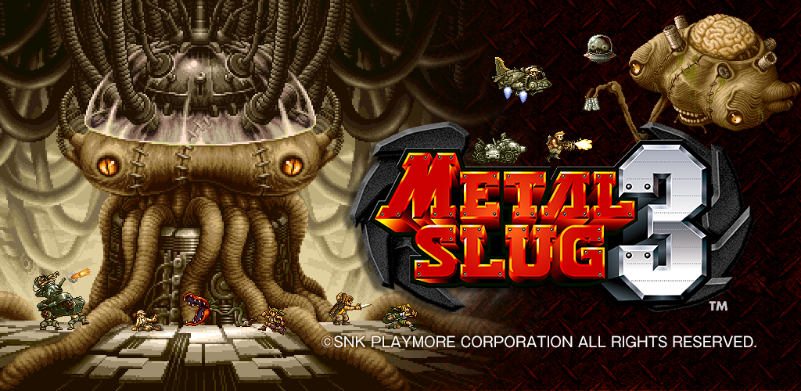

# Introduzione

L'obiettivo del progetto è la realizzazione di un clone del gioco Metal Slug 3, famoso platformer degli anni 2000.

Il gioco consiste nel guidare un soldato, con una pistola e 10 bombe a mano nello zainetto, lungo il territorio nemico e farsi strada attraverso diversi nemici. Durante la sua missione, il soldato può scegliere di salire su una serie di macchinari chiamati Slug che caratterizzano la serie. Questi Slug, ovviamente, danno al giocatore da un lato una maggiore potenza di fuoco e, dall'altro, una migliore resistenza ai colpi subiti.

## Obiettivo del gioco

 Completare la missione assegnata terminando con una vittoria.

## Contributors

- [Leo Marzoli](#)
- [Lorenzo Massone](#)
- [Giacomo Romagnoli](#)
